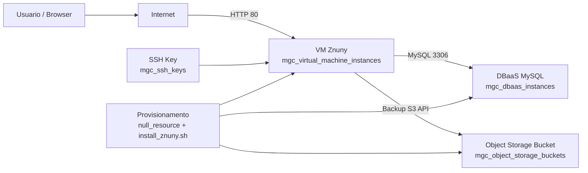

# znuny-magalu-cloud
# Arquitetura para Draw.io (Znuny + Magalu Cloud)

## Objetivo
Este desenho representa a infraestrutura criada pelos arquivos Terraform deste projeto.

## Componentes (caixas)
1. Usuario/Browser
2. Internet
3. VM Znuny (Compute)
   - Recurso Terraform: mgc_virtual_machine_instances.znuny_vm
4. DBaaS MySQL
   - Recurso Terraform: mgc_dbaas_instances.znuny_db
5. Object Storage Bucket (Backup)
   - Recurso Terraform: mgc_object_storage_buckets.znuny_bucket
6. SSH Key
   - Recurso Terraform: mgc_ssh_keys.znuny_key
7. Provisionamento (null_resource)
   - Recurso Terraform: null_resource.znuny_install
   - Script: scripts/install_znuny.sh

## Conexoes (setas)
1. Usuario/Browser -> Internet
   - Protocolo: HTTP
2. Internet -> VM Znuny (porta 80)
   - Acesso ao sistema Znuny
3. VM Znuny -> DBaaS MySQL (porta 3306)
   - Aplicacao usa banco MySQL
4. VM Znuny -> Object Storage Bucket
   - Backup com s3cmd
5. SSH Key -> VM Znuny
   - Chave publica para acesso/provisionamento
6. Provisionamento -> VM Znuny
   - Copia e executa script install_znuny.sh via SSH
7. Provisionamento -> DBaaS MySQL
   - Usa host e credenciais para criar/configurar base
8. Provisionamento -> Object Storage Bucket
   - Configura backup para bucket

## Layout sugerido no Draw.io
1. Coluna esquerda: Usuario/Browser e Internet.
2. Centro: VM Znuny (com destaque principal).
3. Direita superior: DBaaS MySQL.
4. Direita inferior: Object Storage Bucket.
5. Abaixo da VM: Provisionamento (null_resource + script).
6. Acima da VM: SSH Key.

## Legendas uteis
- Ambiente: regiao br-se1
- Aplicacao: Znuny
- Banco: MySQL 8.0
- Backup: sincronizacao para Object Storage diaria

## Mapa Mental
 

## Observacao de seguranca para GitHub
- Nao suba segredos reais.
- Nos arquivos de credenciais deste projeto, use sempre textos com "ALTERAR_AQUI_*" e preencha localmente antes do deploy.
